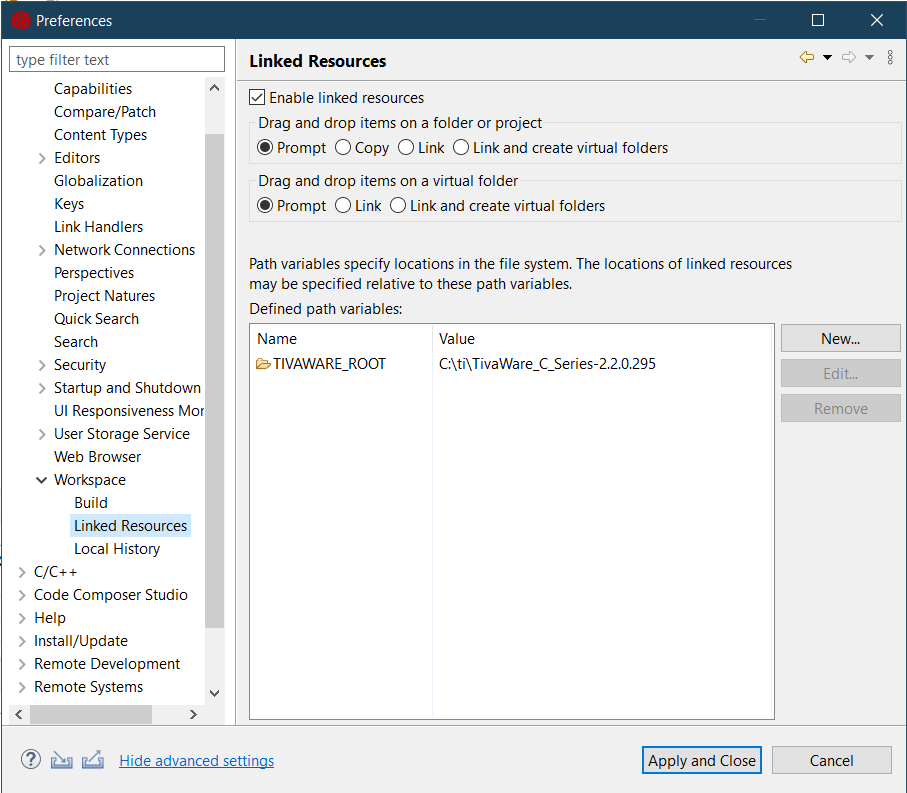

# bad-apple-tm4c123gxl-nokia-5110

Ad hoc tools for playing the [Bad Apple!!](https://en.wikipedia.org/wiki/Bad_Apple!!) song's [famous animation](https://www.youtube.com/watch?v=FtutLA63Cp8) on the TM4C123GXL LaunchPad with the Nokia 5110 display.

## Instructions
1. Download the original animation video from https://www.youtube.com/watch?v=FtutLA63Cp8
2. Install [Python](https://www.python.org/), then the requirements for the Python scripts using `pip install -r requirements.txt` (preferably in a [virtual environment](https://docs.python.org/3/tutorial/venv.html)).
3. Use the [extract-frames.py](extract-frames.py) script to extract frames from the video using a command like:  
`python extract-frames.py --input bad-apple.mp4 --out frames-dir --frame-per-second 25`
4. Use the [frames-to-bitmaps.py](frames-to-bitmaps.py) script to convert the frames to a format the Nokia 5110 display can understand, using a command like:  
  `python frames-to-bitmaps.py --input frames-dir --out bitmaps.bin`
5. Copy the resulting file to the `bad-apple-ccs/Debug` directory. The code assumes it will be named `bitmaps.bin` though you can change that in [bad-apple-ccs/main.c](bad-apple-ccs/main.c).
6. Hook up your Tiva C board and wire the Nokia 5110 LCD connections as described in the [bad-apple-ccs/Nokia5110.h](bad-apple-ccs/Nokia5110.h) file.
    Additionally, wire up the backlight pin to the A4 pin on your board, or change it in the [bad-apple-ccs/main.c](bad-apple-ccs/main.c) file to your liking.
7. If you don't have Code Composer Studio already installed, install it from [here](https://www.ti.com/tool/CCSTUDIO) along with the TivaWare library from [here](https://www.ti.com/tool/download/SW-TM4C).
8. In Code Composer Studio, set up a path variable named `TIVAWARE_ROOT` pointing to the location of the TivaWare library on your system.
  
9.  Open the [bad-apple-ccs](bad-apple-ccs) folder in Code Composer Studio and run the project in **debug mode**. Running it in debug mode is vital, as the code uses the C standard library's IO functions to send data to the card through USB. I originally intended to use a MicroSD card adapter to store the data, but couldn't get my adapter to work with the microcontroller.

## Demo

Demo on Youtube: https://www.youtube.com/watch?v=Bx7Z_19iOPA

I extracted 25 frames per second from the video. The resulting video playback on the board was slow (taking about 12 minutes to finish), so I speeded it up by a factor of around 3.5 using `ffmpeg`:  
`ffmpeg -i in.mp4 -vf "setpts=(PTS-STARTPTS)/3.5" -crf 18 out.mp4`
